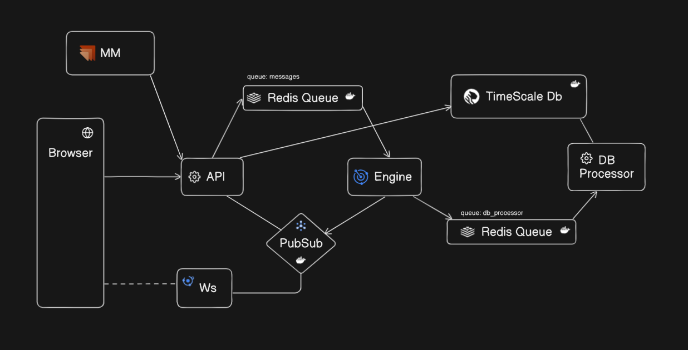

# 📈 Stock Exchange App

A modern stock exchange web application designed to simulate or manage live trading data with high performance and real-time capabilities.

Built with:

- **Backend:** Node.js + Express
- **Database:** TimescaleDB (PostgreSQL + time-series extension)
- **Queue System:** Redis Queue (bull or bullmq)
- **Frontend:** Next.js (React)
- **Caching/Queue Processing:** Redis

---





## 🚀 Features

- Real-time stock ticker updates
- Order matching engine (buy/sell)
- Historical data tracking using TimescaleDB
- Queued processing for scalability using Redis
- Responsive and interactive UI built with Next.js
- Efficient caching and pub/sub for notifications

---

## 🛠️ Tech Stack

| Layer          | Technology                       |
| -------------- | -------------------------------- |
| Backend        | Node.js, Express                 |
| Database       | TimescaleDB (PostgreSQL)         |
| Queue          | Redis + Bull/BullMQ              |
| Frontend       | Next.js (React)                  |
| Caching/PubSub | Redis                            |
| Deployment     | Docker / PM2 / Vercel (optional) |

---

## 🧩 Architecture Overview

```plaintext
User ↔ Frontend (Next.js) ↔ API (Express) ↔ Redis Queue
                                      ↘
                                  TimescaleDB
                                      ↘
                                 Redis Pub/Sub
```
